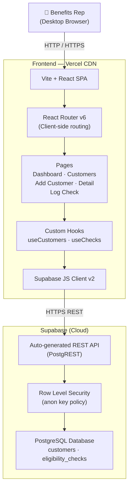
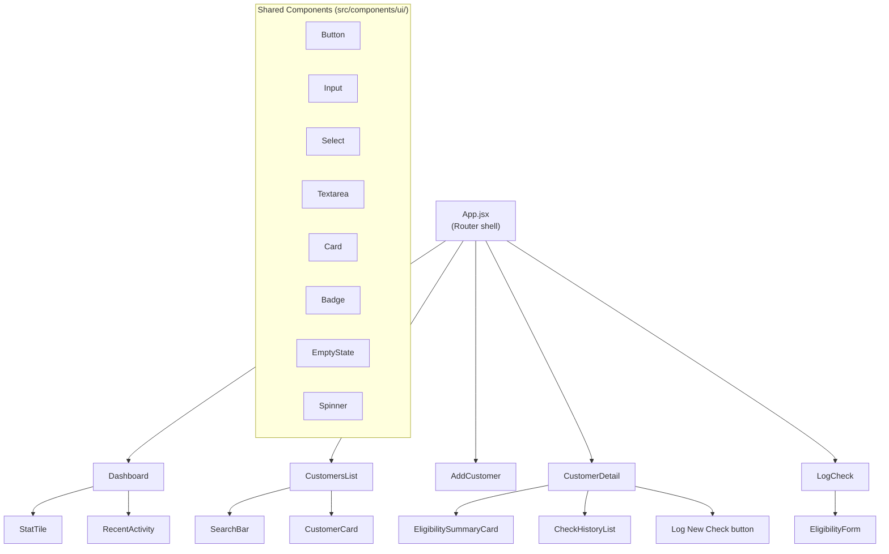
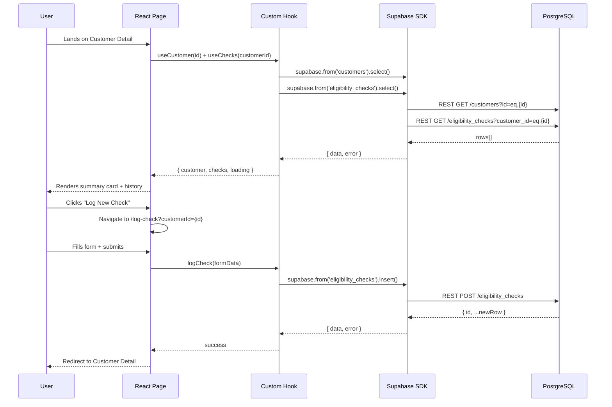
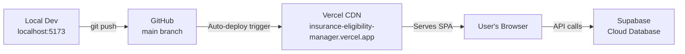

# ARCHITECTURE.md
## Insurance Eligibility Manager
**Day 2 — System Design**  
**Date:** September 7, 2026  

---

## 1. Tech Stack Decision

### Final Stack

| Layer | Technology | Reason | Cost |
|-------|-----------|--------|------|
| **Frontend Framework** | Vite + React 18 | Fastest scaffold for a single-page app; simpler than Next.js for a tool with no SSR requirements; massive community | Free |
| **Styling** | Tailwind CSS v3 | Utility-first; no design decisions in CSS files; fast to prototype; tree-shaken in production | Free |
| **Routing** | React Router v6 | Standard client-side routing for React SPAs; simple, declarative | Free |
| **Database** | Supabase (PostgreSQL) | Free tier covers this project entirely; auto-generates a REST API; built-in JS client; real database (not localStorage) means data persists across devices and sessions | Free |
| **Data Access** | Supabase JS Client v2 | Official SDK; handles all CRUD; no custom backend needed | Free |
| **Authentication** | None (v1.0) | Single-user tool; no login screen; data is accessed directly via Supabase anon key scoped to this project | Free |
| **Hosting** | Vercel | One-click deploy from GitHub; auto-redeploys on push; free hobby tier covers this app easily | Free |
| **Version Control** | GitHub | Standard; integrates directly with Vercel | Free |

### Why NOT Next.js?
Next.js adds server-side rendering complexity that this project doesn't need. Every page in this app is a client-side data fetch — no SEO, no pre-rendering benefit. Vite + React is faster to build and easier to debug for a 10-day sprint.

### Why NOT localStorage?
localStorage is device-specific and lost on browser clears. Supabase's free tier is more than enough for this project, and using a real database makes the capstone significantly more impressive and realistic.

### Why NO authentication?
The PRD explicitly scopes v1.0 as a single-user tool. Adding auth adds 1–2 days of complexity with no benefit in this phase. The Supabase anon key is scoped to only this project and deployed privately.

---

## 2. System Architecture

### High-Level Overview



### Component Architecture



### Data Flow



---

## 3. Request Lifecycle

For every data operation in the app:

```
1. User interaction (click, form submit)
2. React event handler fires
3. Custom hook function called (e.g., useChecks().logCheck(data))
4. Input validated client-side (required fields, types)
5. Supabase SDK constructs REST request
6. HTTPS request to Supabase PostgREST endpoint
7. RLS policy checked (anon key grants full access to this project's tables)
8. PostgreSQL executes query
9. Response returned to SDK
10. Hook updates React state (data / error / loading)
11. Page re-renders with new state
12. User sees updated UI or error message
```

---

## 4. External Services

| Service | Purpose | Free Tier Limits | Used For |
|---------|---------|-----------------|---------|
| **Supabase** | Database + REST API | 500MB storage, 2GB bandwidth/month, unlimited API calls | All data storage and retrieval |
| **Vercel** | Hosting + CDN | 100GB bandwidth/month, unlimited deploys | Serving the React app |
| **GitHub** | Version control | Unlimited public/private repos | Source control + Vercel integration |
| **Google Fonts** | Typography | Unlimited | UI fonts |

All limits are far beyond what a single-user tool handling 6–7 checks/day will ever reach.

---

## 5. Security Considerations (v1.0)

- Supabase anon key is **not a secret** — it's designed to be used client-side
- Row Level Security (RLS) is enabled on both tables with an `anon` select/insert/update/delete policy
- No PII beyond name and DOB is stored (no SSN, no contact info)
- The app is deployed privately on Vercel (URL not publicly advertised)
- No HIPAA compliance required for this capstone personal tool

---

## 6. Deployment Architecture



**Workflow:** Every `git push` to `main` triggers an automatic Vercel redeploy. No manual deployment steps after initial setup.

---

*ARCHITECTURE.md — Insurance Eligibility Manager v1.0*
