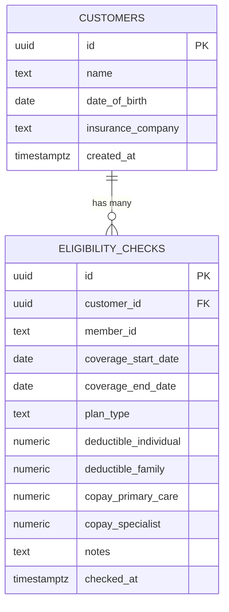

# SCHEMA.md
## Insurance Eligibility Manager — Database Design
**Day 2 — System Design**  
**Database:** PostgreSQL via Supabase  

---

## Entity Relationship Diagram



---

## Table: `customers`

**Purpose:** Stores the basic profile of each client whose insurance eligibility is being tracked.

```sql
CREATE TABLE customers (
  id                UUID          PRIMARY KEY DEFAULT gen_random_uuid(),
  name              TEXT          NOT NULL,
  date_of_birth     DATE          NOT NULL,
  insurance_company TEXT          NOT NULL,
  created_at        TIMESTAMPTZ   NOT NULL DEFAULT NOW()
);
```

### Fields

| Column | Type | Required | Description |
|--------|------|----------|-------------|
| `id` | UUID | Auto | Primary key, auto-generated |
| `name` | TEXT | ✅ | Full name of the customer |
| `date_of_birth` | DATE | ✅ | Used for identity verification during eligibility calls |
| `insurance_company` | TEXT | ✅ | Name of the carrier (e.g., Aetna, Cigna, UnitedHealthcare) |
| `created_at` | TIMESTAMPTZ | Auto | Timestamp when the record was created |

### Indexes

```sql
-- Fast search by name (used by the search bar)
CREATE INDEX idx_customers_name ON customers (name);

-- Fast sort by newest customers first
CREATE INDEX idx_customers_created_at ON customers (created_at DESC);
```

### Notes
- `name` is stored as a single field (not split first/last) to keep the form simple
- `insurance_company` is free text — carriers vary too much to justify a lookup table in v1.0
- No email, phone, or SSN stored — this is a working reference tool, not a CRM

---

## Table: `eligibility_checks`

**Purpose:** Stores each individual insurance eligibility check performed for a customer, including all fields retrieved from the carrier portal.

```sql
CREATE TABLE eligibility_checks (
  id                     UUID          PRIMARY KEY DEFAULT gen_random_uuid(),
  customer_id            UUID          NOT NULL REFERENCES customers(id) ON DELETE CASCADE,
  member_id              TEXT          NOT NULL,
  coverage_start_date    DATE          NOT NULL,
  coverage_end_date      DATE          NOT NULL,
  plan_type              TEXT          NOT NULL CHECK (plan_type IN ('HMO', 'PPO', 'EPO', 'POS', 'Other')),
  deductible_individual  NUMERIC(10,2) NOT NULL CHECK (deductible_individual >= 0),
  deductible_family      NUMERIC(10,2) NOT NULL CHECK (deductible_family >= 0),
  copay_primary_care     NUMERIC(10,2) NOT NULL CHECK (copay_primary_care >= 0),
  copay_specialist       NUMERIC(10,2) NOT NULL CHECK (copay_specialist >= 0),
  notes                  TEXT,
  checked_at             TIMESTAMPTZ   NOT NULL DEFAULT NOW()
);
```

### Fields

| Column | Type | Required | Description |
|--------|------|----------|-------------|
| `id` | UUID | Auto | Primary key |
| `customer_id` | UUID | ✅ | Foreign key → customers.id |
| `member_id` | TEXT | ✅ | Member ID from the insurance carrier |
| `coverage_start_date` | DATE | ✅ | Start date of current coverage period |
| `coverage_end_date` | DATE | ✅ | End date of current coverage period |
| `plan_type` | TEXT | ✅ | One of: HMO, PPO, EPO, POS, Other |
| `deductible_individual` | NUMERIC(10,2) | ✅ | Individual deductible in dollars |
| `deductible_family` | NUMERIC(10,2) | ✅ | Family deductible in dollars |
| `copay_primary_care` | NUMERIC(10,2) | ✅ | Co-pay for primary care visits |
| `copay_specialist` | NUMERIC(10,2) | ✅ | Co-pay for specialist visits |
| `notes` | TEXT | ❌ | Optional freeform notes from the call |
| `checked_at` | TIMESTAMPTZ | Auto | Timestamp when the check was logged |

### Indexes

```sql
-- Fast lookup of all checks for a customer (most common query)
CREATE INDEX idx_checks_customer_id ON eligibility_checks (customer_id);

-- Fast sort — most recent check first
CREATE INDEX idx_checks_checked_at ON eligibility_checks (customer_id, checked_at DESC);
```

### Constraints Explained
- `ON DELETE CASCADE` — if a customer is deleted, all their checks are deleted too
- `CHECK (plan_type IN (...))` — enforces valid plan type at database level, not just UI
- `CHECK (... >= 0)` — deductibles and co-pays cannot be negative
- `NUMERIC(10,2)` — stores up to 99,999,999.99 with 2 decimal places (cents precision)

---

## Row Level Security (RLS) Policies

Supabase requires RLS to be enabled. Since v1.0 has no authentication, we allow the anon role full access.

```sql
-- Enable RLS
ALTER TABLE customers ENABLE ROW LEVEL SECURITY;
ALTER TABLE eligibility_checks ENABLE ROW LEVEL SECURITY;

-- Allow anon role full access (single-user app, no auth in v1.0)
CREATE POLICY "anon_all_customers"
  ON customers FOR ALL TO anon USING (true) WITH CHECK (true);

CREATE POLICY "anon_all_checks"
  ON eligibility_checks FOR ALL TO anon USING (true) WITH CHECK (true);
```

---

## User Story Validation

Verifying the schema supports every user story from the PRD:

| User Story | Supported By |
|-----------|-------------|
| US-01: Add a new customer | `INSERT INTO customers` — all 3 required fields present |
| US-02: Log eligibility data | `INSERT INTO eligibility_checks` — all 6 key fields + notes |
| US-03: View clean summary | `SELECT * FROM eligibility_checks WHERE customer_id = ? ORDER BY checked_at DESC LIMIT 1` |
| US-04: Search customer by name | `SELECT * FROM customers WHERE name ILIKE '%query%'` |
| US-05: See history of checks | `SELECT * FROM eligibility_checks WHERE customer_id = ? ORDER BY checked_at DESC` |
| US-06: Know when last check was | `checked_at` field on each row; most recent is index 0 |

✅ All 6 user stories are fully supported by the schema.

---

## Full Setup SQL (Run in Supabase SQL Editor on Day 3)

```sql
-- Step 1: Create tables
CREATE TABLE customers (
  id                UUID          PRIMARY KEY DEFAULT gen_random_uuid(),
  name              TEXT          NOT NULL,
  date_of_birth     DATE          NOT NULL,
  insurance_company TEXT          NOT NULL,
  created_at        TIMESTAMPTZ   NOT NULL DEFAULT NOW()
);

CREATE TABLE eligibility_checks (
  id                     UUID          PRIMARY KEY DEFAULT gen_random_uuid(),
  customer_id            UUID          NOT NULL REFERENCES customers(id) ON DELETE CASCADE,
  member_id              TEXT          NOT NULL,
  coverage_start_date    DATE          NOT NULL,
  coverage_end_date      DATE          NOT NULL,
  plan_type              TEXT          NOT NULL CHECK (plan_type IN ('HMO', 'PPO', 'EPO', 'POS', 'Other')),
  deductible_individual  NUMERIC(10,2) NOT NULL CHECK (deductible_individual >= 0),
  deductible_family      NUMERIC(10,2) NOT NULL CHECK (deductible_family >= 0),
  copay_primary_care     NUMERIC(10,2) NOT NULL CHECK (copay_primary_care >= 0),
  copay_specialist       NUMERIC(10,2) NOT NULL CHECK (copay_specialist >= 0),
  notes                  TEXT,
  checked_at             TIMESTAMPTZ   NOT NULL DEFAULT NOW()
);

-- Step 2: Create indexes
CREATE INDEX idx_customers_name ON customers (name);
CREATE INDEX idx_customers_created_at ON customers (created_at DESC);
CREATE INDEX idx_checks_customer_id ON eligibility_checks (customer_id);
CREATE INDEX idx_checks_checked_at ON eligibility_checks (customer_id, checked_at DESC);

-- Step 3: Enable RLS
ALTER TABLE customers ENABLE ROW LEVEL SECURITY;
ALTER TABLE eligibility_checks ENABLE ROW LEVEL SECURITY;

-- Step 4: RLS policies (anon access for v1.0)
CREATE POLICY "anon_all_customers"
  ON customers FOR ALL TO anon USING (true) WITH CHECK (true);

CREATE POLICY "anon_all_checks"
  ON eligibility_checks FOR ALL TO anon USING (true) WITH CHECK (true);
```

---

*SCHEMA.md — Insurance Eligibility Manager v1.0*
