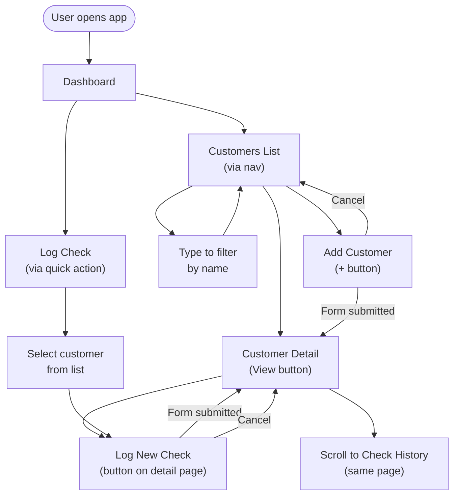

# UI-WIREFRAMES.md
## Insurance Eligibility Manager — UI & User Flow
**Day 2 — System Design**  

---

## User Flow Diagram



---

## Screen Map

| Screen | Route | Purpose |
|--------|-------|---------|
| Dashboard | `/` | Overview stats + recent activity + quick actions |
| Customers List | `/customers` | Browse and search all customers |
| Add Customer | `/customers/new` | Form to add a new customer |
| Customer Detail | `/customers/:id` | Summary card + check history |
| Log Check | `/customers/:id/check` | Form to log a new eligibility check |

---

## Wireframes

### Screen 1 — Dashboard `/`

```
┌──────────────────────────────────────────────────────────┐
│ ☰  Insurance Eligibility Manager          [+ Add Customer]│
├──────────────────────────────────────────────────────────┤
│                                                           │
│  Good morning, Orbit.                                     │
│                                                           │
│  ┌─────────────┐  ┌─────────────┐  ┌──────────────────┐  │
│  │ 24          │  │ 3           │  │ Maria Johnson    │  │
│  │ Total       │  │ Checks      │  │ Last check       │  │
│  │ Customers   │  │ Today       │  │ 12 min ago       │  │
│  └─────────────┘  └─────────────┘  └──────────────────┘  │
│                                                           │
│  ── Recent Activity ──────────────────────────────────   │
│                                                           │
│  Maria Johnson · Aetna · PPO    Sep 7, 2026  2:30 PM   │
│  James Patel · Cigna · HMO      Sep 7, 2026  11:15 AM  │
│  Linda Cruz · UHC · EPO         Sep 7, 2026  10:02 AM  │
│  Robert Kim · BCBS · PPO        Sep 6, 2026  3:45 PM   │
│  Diane Lee · Humana · HMO       Sep 6, 2026  1:20 PM   │
│                                                           │
│  ── Quick Actions ────────────────────────────────────   │
│  [+ Add Customer]       [View All Customers →]           │
│                                                           │
└──────────────────────────────────────────────────────────┘
```

**Elements:**
- Top nav: app name (left) + "Add Customer" button (right)
- 3 stat tiles: Total Customers, Checks Today, Last Check Performed
- Recent Activity: last 5 checks with customer name, carrier, plan type, and timestamp
- Quick action buttons at the bottom

---

### Screen 2 — Customers List `/customers`

```
┌──────────────────────────────────────────────────────────┐
│ ☰  Insurance Eligibility Manager          [+ Add Customer]│
├──────────────────────────────────────────────────────────┤
│                                                           │
│  Customers                                                │
│                                                           │
│  🔍 Search by name...                                     │
│  ──────────────────────────────────────────────────────  │
│                                                           │
│  ┌────────────────────────────────────────────────────┐   │
│  │ Maria Johnson                    Aetna             │   │
│  │ DOB: Apr 12, 1985           [Log Check] [View →]  │   │
│  └────────────────────────────────────────────────────┘   │
│                                                           │
│  ┌────────────────────────────────────────────────────┐   │
│  │ James Patel                      Cigna             │   │
│  │ DOB: Jul 3, 1972            [Log Check] [View →]  │   │
│  └────────────────────────────────────────────────────┘   │
│                                                           │
│  ┌────────────────────────────────────────────────────┐   │
│  │ Linda Cruz                       UnitedHealthcare  │   │
│  │ DOB: Nov 22, 1990           [Log Check] [View →]  │   │
│  └────────────────────────────────────────────────────┘   │
│                                                           │
│  Showing 24 customers                                     │
│                                                           │
└──────────────────────────────────────────────────────────┘
```

**Elements:**
- Search bar at top — filters list in real time as user types
- Each customer card: name (large), carrier (right), DOB (small)
- Two actions per card: "Log Check" (goes directly to form) and "View →" (goes to detail)
- Total count at the bottom

**Empty state (no customers yet):**
```
┌────────────────────────────────────────────┐
│                                            │
│        No customers yet.                  │
│   Add your first customer to get started. │
│                                            │
│          [+ Add Customer]                 │
│                                            │
└────────────────────────────────────────────┘
```

---

### Screen 3 — Add Customer `/customers/new`

```
┌──────────────────────────────────────────────────────────┐
│ ←  Back to Customers                                      │
├──────────────────────────────────────────────────────────┤
│                                                           │
│  Add New Customer                                         │
│                                                           │
│  Full Name *                                              │
│  ┌──────────────────────────────────────────────────┐    │
│  │ Maria Johnson                                    │    │
│  └──────────────────────────────────────────────────┘    │
│                                                           │
│  Date of Birth *                                          │
│  ┌──────────────────────────────────────────────────┐    │
│  │ 04/12/1985                               📅      │    │
│  └──────────────────────────────────────────────────┘    │
│                                                           │
│  Insurance Company *                                      │
│  ┌──────────────────────────────────────────────────┐    │
│  │ Aetna                                            │    │
│  └──────────────────────────────────────────────────┘    │
│                                                           │
│  [Cancel]                          [Save Customer →]     │
│                                                           │
└──────────────────────────────────────────────────────────┘
```

**Validation state:**
```
Full Name *
┌──────────────────────────────────────────────────┐
│                                                  │  ← red border
└──────────────────────────────────────────────────┘
⚠ Name is required
```

---

### Screen 4 — Customer Detail `/customers/:id`

```
┌──────────────────────────────────────────────────────────┐
│ ←  Back to Customers                  [+ Log New Check]  │
├──────────────────────────────────────────────────────────┤
│                                                           │
│  Maria Johnson                                            │
│  Aetna · DOB: Apr 12, 1985                               │
│                                                           │
│  ── Latest Eligibility ────────────────────────────────  │
│  ┌────────────────────────────────────────────────────┐   │
│  │  ✅ ACTIVE                    Checked Sep 7, 2026  │   │
│  │                                                    │   │
│  │  MEMBER ID          PLAN TYPE                      │   │
│  │  AET123456789       PPO                            │   │
│  │                                                    │   │
│  │  COVERAGE PERIOD                                   │   │
│  │  Jan 1, 2026 – Dec 31, 2026                        │   │
│  │                                                    │   │
│  │  DEDUCTIBLE         Individual    Family           │   │
│  │                     $1,500        $3,000           │   │
│  │                                                    │   │
│  │  CO-PAY             Primary Care  Specialist       │   │
│  │                     $25           $50              │   │
│  │                                                    │   │
│  │  NOTES                                             │   │
│  │  Active. Confirmed by rep James at Aetna.         │   │
│  └────────────────────────────────────────────────────┘   │
│                                                           │
│  ── Check History ─────────────────────────────────────  │
│                                                           │
│  Sep 7, 2026   PPO · AET123456789               [▼]     │
│  Aug 1, 2026   PPO · AET123456789               [▼]     │
│  Jun 15, 2026  HMO · AET987654321               [▼]     │
│                                                           │
└──────────────────────────────────────────────────────────┘
```

**Key design decisions:**
- Summary card is prominently placed — designed to be read aloud on a callback call
- Labels are small caps, values are large and clear
- "Log New Check" button is sticky/always visible at top right
- History rows are collapsed by default (click [▼] to expand full details)

**Empty state (no checks logged yet):**
```
┌────────────────────────────────────────────┐
│  No eligibility checks logged yet.        │
│  [+ Log First Check]                      │
└────────────────────────────────────────────┘
```

---

### Screen 5 — Log Eligibility Check `/customers/:id/check`

```
┌──────────────────────────────────────────────────────────┐
│ ←  Back to Maria Johnson                                  │
├──────────────────────────────────────────────────────────┤
│                                                           │
│  Log Eligibility Check                                    │
│  Maria Johnson · Aetna                                    │
│  Date of Check: Sep 7, 2026  (auto-filled)               │
│                                                           │
│  Member ID *                                              │
│  ┌──────────────────────────────────────────────────┐    │
│  │ AET123456789                                     │    │
│  └──────────────────────────────────────────────────┘    │
│                                                           │
│  Coverage Period *                                        │
│  ┌─────────────────────┐   ┌─────────────────────────┐   │
│  │ 01/01/2026     📅   │to │ 12/31/2026          📅  │   │
│  └─────────────────────┘   └─────────────────────────┘   │
│                                                           │
│  Plan Type *                                              │
│  ┌──────────────────────────────────────────────────┐    │
│  │ PPO                                           ▼  │    │
│  └──────────────────────────────────────────────────┘    │
│  Options: HMO / PPO / EPO / POS / Other                  │
│                                                           │
│  Deductible *                      Co-Pay *              │
│  ┌───────────────┐ ┌────────────┐  ┌──────────┐ ┌──────┐ │
│  │ Ind: $1,500   │ │ Fam: $3,000│  │ PCP: $25 │ │$50   │ │
│  └───────────────┘ └────────────┘  └──────────┘ └──────┘ │
│                                                           │
│  Notes (optional)                                        │
│  ┌──────────────────────────────────────────────────┐    │
│  │ Active. Confirmed by rep James at Aetna.         │    │
│  │                                                  │    │
│  └──────────────────────────────────────────────────┘    │
│                                                           │
│  [Cancel]                            [Save Check →]      │
│                                                           │
└──────────────────────────────────────────────────────────┘
```

**Key design decisions:**
- Customer name + carrier shown at top — confirms who this check is for
- Date of Check auto-filled (read-only) — one less thing to type
- Deductible and co-pay fields side by side to save vertical space
- Notes field is optional and last — not required for the summary card

---

## Navigation Structure

```
Top Nav (persistent)
├── [☰ Menu icon] — opens sidebar on mobile
├── App name / logo → /
└── [+ Add Customer] → /customers/new

Sidebar / Nav Links
├── Dashboard         → /
└── Customers         → /customers

Breadcrumb (on detail pages)
├── ← Back to Customers    → /customers
└── ← Back to [Name]       → /customers/:id
```

---

## Responsive Behavior

| Breakpoint | Layout |
|-----------|--------|
| Desktop (≥1024px) | Sidebar nav + main content, side-by-side deductible/copay fields |
| Tablet (768–1023px) | Collapsible top nav, single column content |
| Mobile (< 768px) | Hamburger menu, full-width forms, stacked deductible/copay fields |

**Primary target:** Desktop (user is seated at a desk, on the phone).

---

*UI-WIREFRAMES.md — Insurance Eligibility Manager v1.0*
